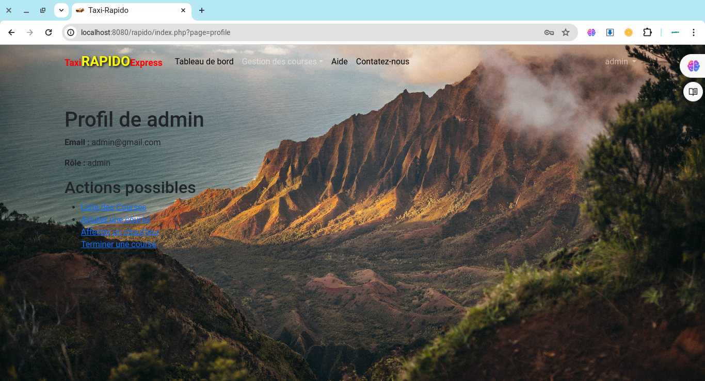
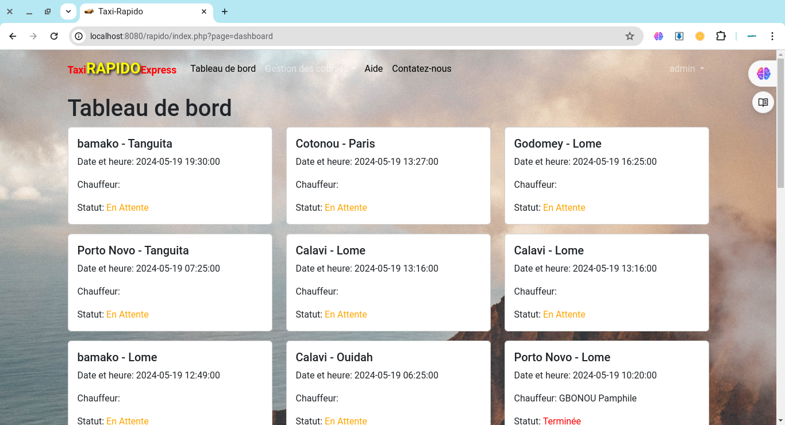

# Rapport de TP

## Rédigé par 

Yémalin E. Morel KPAVODE  

## Supervisé par
                                                         Mr. Tidjani SANDA

----------------------------------------------------------------------------

### Introduction

#### Contexte
Ce rapport présente les travaux pratiques réalisés dans le cadre du développement d'une application web de gestion des courses de taxi. L'objectif est de concevoir et d'implémenter une application permettant aux utilisateurs de réserver des courses, aux administrateurs de gérer les chauffeurs et les courses, et aux chauffeurs de terminer les courses qui leur sont affectées.

#### Problème
Le problème principal adressé dans ce TP est de créer un système de gestion de courses de taxi efficace et convivial, intégrant différentes fonctionnalités pour les utilisateurs, les chauffeurs et les administrateurs. L'application doit assurer une gestion fluide des réservations, des affectations de chauffeurs et des statuts des courses.

#### Plan du Document
1. Présentation du sujet
2. Schéma relationnel de la BD
3. Réalisation
    1. Outils utilisés
    2. Dessin d'écran
4. Conclusion
    - Point des réalisations
    - Impression
    - Perspectives

---

### I. Présentation du sujet
Le sujet de ce TP consiste à développer une application web de gestion des courses de taxi. Les fonctionnalités principales incluent la réservation de courses par les utilisateurs, l'affectation de chauffeurs par les administrateurs, et la gestion des statuts des courses par les chauffeurs. L'application est conçue pour être intuitive et sécurisée, offrant une expérience utilisateur optimale.

---

### II. Schéma Relationnel de la BD
Le schéma relationnel de la base de données est composé des tables suivantes :

#### Table `utilisateurs`
- `id` (int, auto-increment, primary key)
- `nom_utilisateur` (varchar)
- `email` (varchar)
- `mot_de_passe` (varchar)
- `role` (enum: 'utilisateur', 'chauffeur', 'administrateur')

#### Table `courses`
- `id` (int, auto-increment, primary key)
- `point_depart` (varchar)
- `point_arrive` (varchar)
- `date_heure` (datetime)
- `statut` (enum: 'En Attente', 'En Cours', 'Terminée')
- `chauffeur_id` (int, foreign key referencing `utilisateurs(id)`)

---

### III. Réalisation

#### 1. Outils utilisés
- **Langages de programmation** : PHP, HTML, CSS, JavaScript
- **Frameworks et bibliothèques** : Bootstrap (pour le design), jQuery (pour l'interactivité)
- **Système de gestion de base de données** : MySQL
- **Serveur web** : Apache (XAMPP)
- **Environnement de développement** : Visual Studio Code
- Utilisateurs par défaut:
    - name: user; password: user; role: utilisateur
    - name: admin; password: admin role: administrateur
    - name: driver; password: driver; role: chauffeur
#### 2. Dessin d'écran
- **Page d'accueil**
  
- **Formulaire de connexion**
  
- **Formulaire d'inscription**
  
- **Page de gestion des courses**
  
- **Page de profil utilisateur**
  
- **Assigner Chauffeur à une course en attente**
  
- **Terminer une course en cours**
  
- **Liste de toutes les courses**
  
- **Page d'aide**
  
- **Nous Contacter**
  

3

---

### Conclusion

#### Point des réalisations
L'application développée permet aux utilisateurs de réserver des courses, aux administrateurs d'affecter des chauffeurs, et aux chauffeurs de gérer les statuts des courses. Toutes les fonctionnalités sont intégrées et fonctionnent correctement.

#### Impression
Le projet a permis de mettre en pratique les concepts appris en cours, notamment la gestion des bases de données relationnelles, l'implémentation de la sécurité avec le hachage des mots de passe, et le développement d'une interface utilisateur avec Bootstrap. J'ai à utiliser le modèle MVC pour ce projet. En utilisant l'architecture MVC, le projet est plus facile à maintenir, à tester et à faire évoluer. Les responsabilités sont clairement définies et séparées, ce qui permet une meilleure organisation du code et une collaboration plus efficace entre les développeurs.

#### Perspectives
Pour les travaux futurs, il serait intéressant d'ajouter des fonctionnalités supplémentaires telles que :
- La géolocalisation des chauffeurs et des utilisateurs.
- La notification en temps réel des statuts des courses.
- Une application mobile complémentaire pour les chauffeurs et les utilisateurs.
